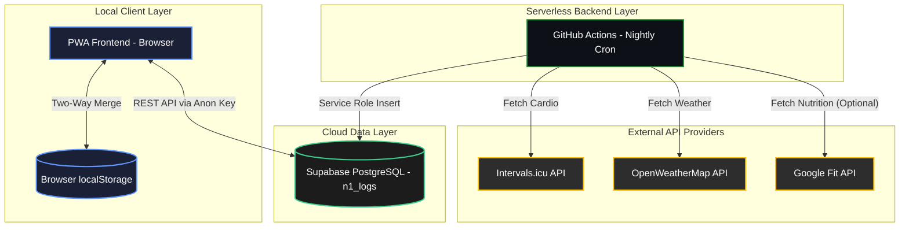
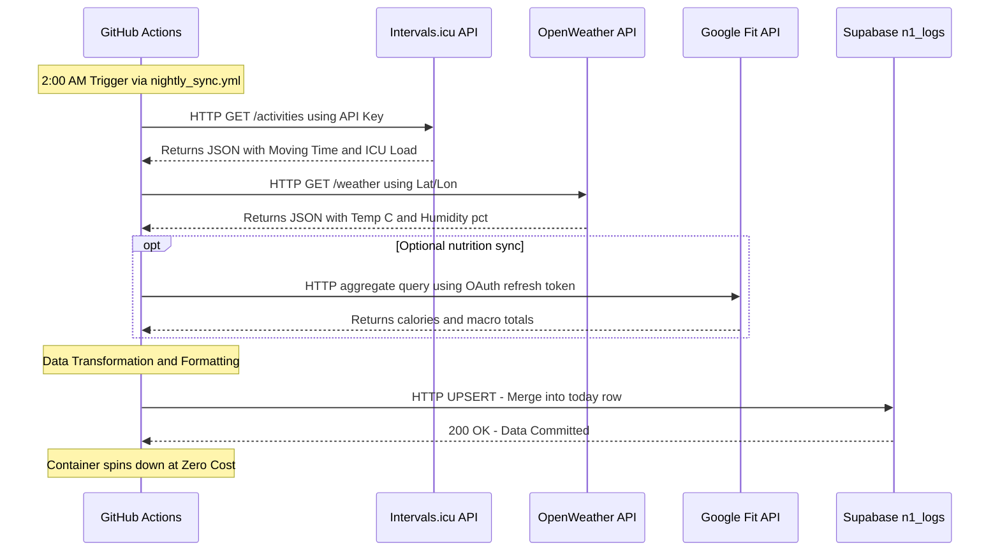
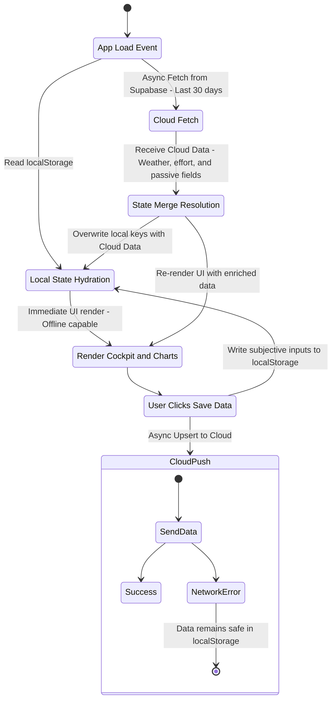
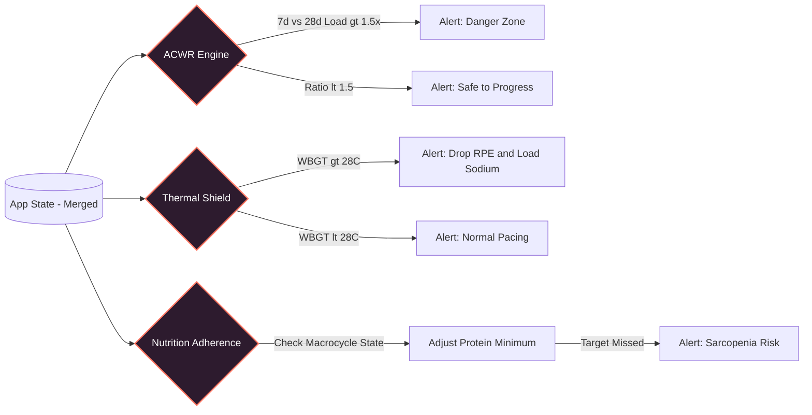

# N=1 Performance Lab — Architecture & Data Flow

This document maps out the complete lifecycle of data across the N=1 Performance Lab's hybrid architecture. It illustrates how local browser storage, serverless GitHub Actions, external APIs, and the Supabase cloud database interact securely and efficiently.

---

## 1. High-Level System Architecture

The ecosystem relies on a strict separation of concerns. The PWA acts as the offline-capable presentation and predictive layer, while the GitHub Action serves as the headless "Passive Engine" doing the heavy lifting of API extraction. Supabase acts as the central source of truth uniting them.

---

## 2. The Passive Ingestion Flow (Backend)

Every night at 2:00 AM, the headless `sync_engine.js` script fires up inside a GitHub Actions container. Its purpose is to bypass expensive API limits (like Strava) and enrich the database with objective environmental, training, and nutrition data.

---

## 3. The Two-Way Synchronization Flow (Frontend)

To ensure the user always has a seamless experience even without cellular data, the PWA follows an "Offline-First" state management protocol. It uses `localStorage` as the primary working memory, and only syncs with Supabase asynchronously.

---

## 4. The Cockpit Analytics Flow

Once data is successfully aggregated in `localStorage` (combining the user's subjective inputs and the cloud's objective scraped data), the Cockpit Dashboard's predictive engine runs its algorithms before rendering the UI.

---

## Cockpit Interactions (UI → Data Mapping)

A concise mapping of Cockpit UI controls to the underlying state and behavior:

- **Session Pills (`Strength & Structure`)** — writes `data.gymType` (`NONE` / `DAY_A` / `DAY_B` / `TENDON`). Selecting a non-`NONE` value auto-reveals the `gym-details` panel so users can enter start time, primary lift, sets/weights and toggle `prehabDone`.
- **Macrocycle Pills** — writes `state.macrocycle` (Hypertrophy / Strength / Endurance / Deload). This immediately affects alert thresholds in the Cockpit analytics (ACWR limit relaxation during `DELOAD`, stricter protein targets during `HYPERTROPHY`).
- **Quick Actions**:
    - `Mark Recovery Day` → sets today's `gymType = 'NONE'` and lowers `cnsFatigue` in the saved `data` object.
    - `Log NSAID` → toggles `data.nsaidsTaken` for today; used by tendon and hypertrophy risk logic.
    - `Add Biomarker` → prompts and writes keys such as `bioCortisol`/`bioHscrp` to today's `data` JSONB payload.
    - `Export Cockpit CSV` → reads last 30 days from local `state.logs` and emits a CSV of `acwr, wbgt, tdee, fatigue, totalCals, stravaEffort`.

These controls follow the app's offline-first pattern: changes update `localStorage` immediately and are upserted to Supabase asynchronously when available.

## 5. File-Level Dependency Map

A quick reference for how the source files relate to each other.

| File | Role | Depends On |
| :--- | :--- | :--- |
| `index.html` | UI shell, DOM structure, all views and tabs | `styles.css`, `app.js`, Chart.js CDN, Lucide CDN, Supabase CDN |
| `styles.css` | Glassmorphism design system, responsive layout | None |
| `app.js` | State management, chart rendering, Cockpit alerts, two-way Supabase sync | Supabase SDK, Chart.js, `localStorage` |
| `sync_engine.js` | Headless backend worker for nightly API scraping | `node-fetch`, Intervals.icu API, OpenWeatherMap API, optional Google Fit API, Supabase REST |
| `sw.js` | Service Worker for offline caching | None (runs in browser background) |
| `supabase_schema.sql` | PostgreSQL schema definition for `n1_logs` table | Supabase SQL Editor |
| `manifest.json` | PWA metadata (name, icons, theme color) | None |
| `.github/workflows/nightly_sync.yml` | GitHub Actions cron job definition | Repository Secrets, `sync_engine.js` |
| `google_fit_setup.js` | OAuth helper for Google Fit (optional bridge setup) | Google Cloud Console credentials |
| `playwright_check.js` | End-to-end smoke test suite | Playwright, local dev server |

---

## 6. Data Schema (Supabase `n1_logs` Table)

The table uses a single JSONB column to store the full daily state, making it infinitely extensible without schema migrations.

| Column | Type | Description |
| :--- | :--- | :--- |
| `date_id` | `TEXT` (PK) | The date key in `YYYY-MM-DD` format |
| `data` | `JSONB` | The complete daily metrics payload (all fields from `getEmptyLog()`) |
| `created_at` | `TIMESTAMPTZ` | Auto-set on first insert |
| `updated_at` | `TIMESTAMPTZ` | Auto-updated via trigger on every upsert |

### Key Fields Inside the `data` JSONB Payload

| Category | Fields |
| :--- | :--- |
| **Subjective** | `weight`, `cnsFatigue`, `aerobicRpe`, `sleepHrs`, `sleepQual`, `hrv` |
| **Injury** | `injuryLoc`, `injuryPain` |
| **Pharmacology** | `caffeineMg`, `nsaidsTaken` |
| **Biomarkers** | `bioTest`, `bioCortisol`, `bioHscrp`, `bioFerritin` |
| **Strength** | `gymType`, `gymStart`, `prehabDone`, `liftName`, `liftWeight`, `liftSets`, `liftRir` |
| **Muscle Volume** | `muscleTarget`, `muscleSets` |
| **Cardio** | `cardioType`, `manualCardioDuration`, `manualCardioRpe` |
| **Strava / Intervals (Passive)** | `stravaPace`, `stravaHr`, `stravaEffort` |
| **Dormant / Schema-Ready** | `shoeId`, `shoeDist` |
| **Fueling** | `intraCarbs`, `preSodium`, `postRefeed` |
| **Nutrition** | `totalCals`, `proG`, `carbsG`, `fatsG` |
| **Weather (Passive)** | `weatherTempC`, `weatherHumidity` |
| **Environment** | `tempC`, `humidity` |

### Additive Athlete OS Domain Tables

`supabase_schema.sql` also defines normalized tables for the Athlete OS MVP: `user_profiles`, `body_scan_logs`, `workout_sessions`, `strength_sets`, `pain_logs`, `nutrition_logs`, `recovery_readiness_logs`, `weather_snapshots`, `alerts`, `strava_connections`, `strava_activities_raw`, `mobility_tendon_checklists`, `movement_quality_logs`, `weekly_reviews`, and `phase_progression_checks`.

The active PWA still hydrates and saves through `n1_logs` for offline-first speed. The normalized tables are ready for backend write-through, reporting jobs, and future Supabase Auth hardening.
