# N=1 Performance Lab — System Reference

Complete documentation of every workflow, data flow, calculation, and business rule.

---

## Architecture Overview

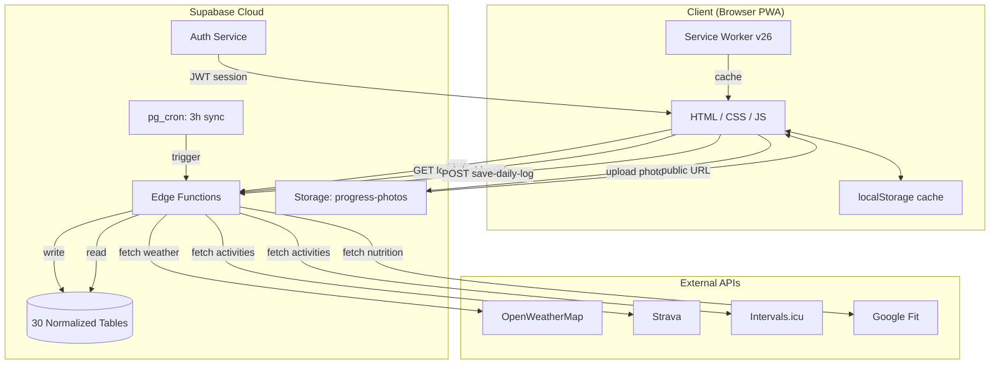

---

## Table of Contents

1. [Startup Sequence](#1-startup-sequence)
2. [Authentication Flow](#2-authentication-flow)
3. [Data Load Flow](#3-data-load-flow)
4. [Data Save Flow](#4-data-save-flow)
5. [Edge Functions](#5-edge-functions)
6. [Database Schema (30 Tables)](#6-database-schema)
7. [Alert & Decision Engine](#7-alert--decision-engine)
8. [Calculations & Formulas](#8-calculations--formulas)
9. [New Data Category Workflows](#9-new-data-category-workflows)
10. [External Integrations](#10-external-integrations)
11. [Charts](#11-charts)
12. [Navigation & UI](#12-navigation--ui)

---

## 1. Startup Sequence

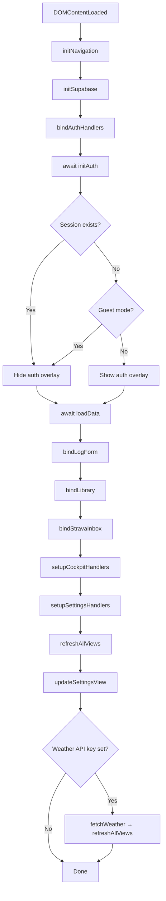

---

## 2. Authentication Flow

### States
| State | Condition | Behavior |
|---|---|---|
| **Authenticated** | `supabaseClient.auth.getSession()` returns a user | `currentUser` set, overlay hidden, cloud sync active |
| **Guest** | `localStorage.n1_guest_mode === 'true'` | Uses UUID `00000000-0000-0000-0000-000000000001`, cloud sync active |
| **Unauthenticated** | No session, no guest flag | Auth overlay shown, app blocked |

### Flows

**Login**: `handleLogin()` → `signInWithPassword({email, password})` → store `n1_user_id` → `loadData()` → `refreshAllViews()`

**Signup**: `handleSignup()` → `signUp({email, password})` → `profiles.upsert({id, display_name})` → same as login

**Logout**: `handleLogout()` → `auth.signOut()` → clear `n1_user_id`, `n1_guest_mode`, `n1_pwa_state` → clear all `state.*` arrays → `showAuthOverlay()`

**Guest**: `handleGuestMode()` → store guest UUID as `n1_user_id` → set `n1_guest_mode=true` → hide overlay

### User Scoping
- All Supabase queries filter by `user_id = getUserId()`
- `n1_logs` compat: non-guest users get `date_id = "{uid.slice(0,8)}_{date}"` prefix
- RLS policies on all tables use `public.auth_uid()` helper (returns JWT `auth.uid()` or guest UUID)

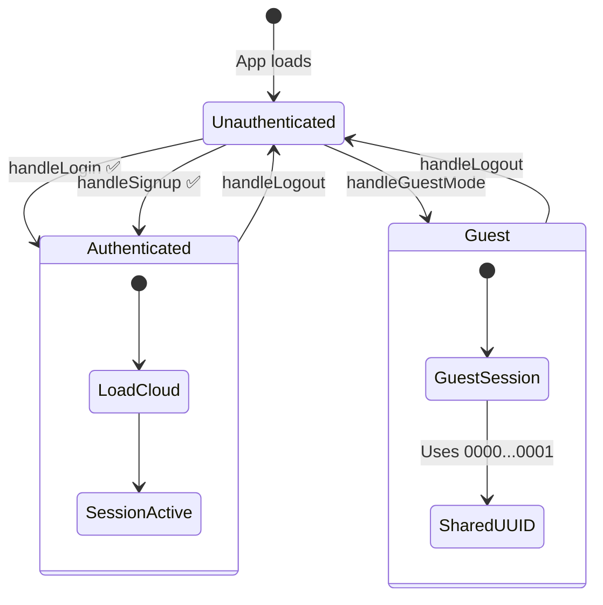

---

## 3. Data Load Flow

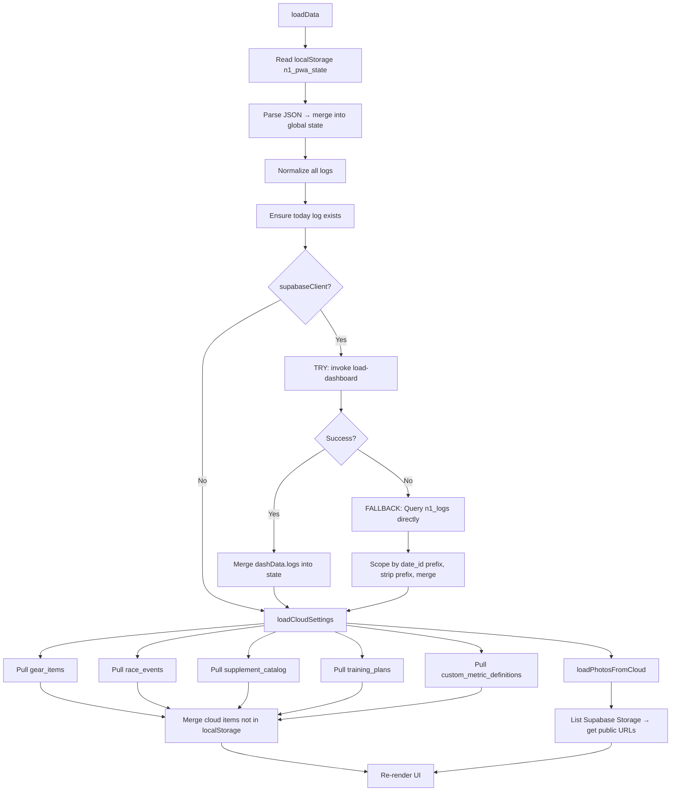

### Cloud Pull Merge Logic
Each category uses a **merge-only** strategy: cloud items whose `name` doesn't exist in localStorage are appended. Existing local items are never overwritten.

---

## 4. Data Save Flow

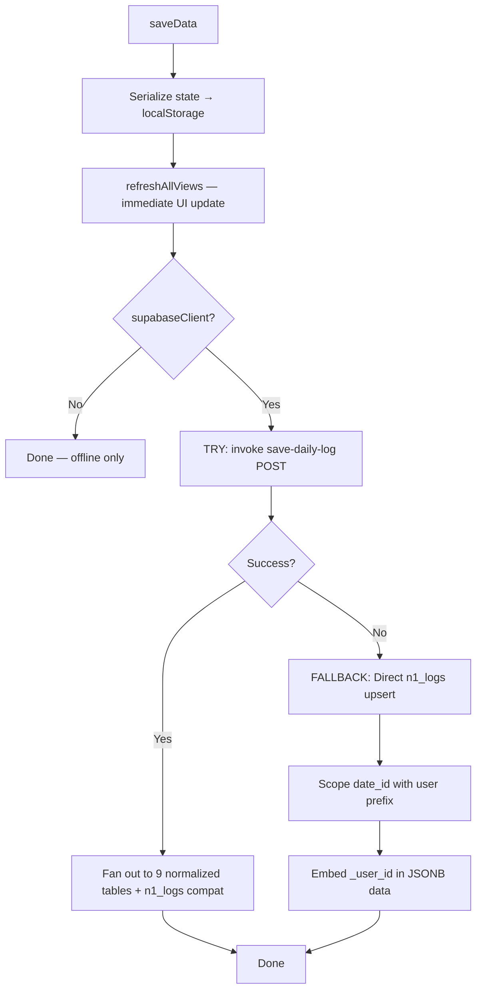

### What Gets Saved
The entire `state.logs[today]` object (~70 flat fields) is sent. The edge function conditionally writes to:
- `daily_logs` — always
- `recovery_logs` — always
- `nutrition_logs` — always
- `workout_sessions` — if cardioType != NONE or gymType != NONE
- `gym_sessions` + `strength_sets` — if gymType != NONE
- `pain_logs` — if injuryLoc is set
- `body_scan_logs` — if inbodyDate is set
- `biomarker_logs` — if any bio* field is set
- `mobility_tendon_checklists` — if any mobility flag is true
- `n1_logs` — always (backwards compat)

---

## 5. Edge Functions

### 5a. `save-daily-log` (POST)

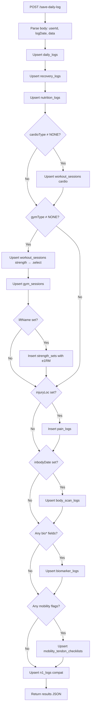

**Input**: `{ userId, logDate, data: {...} }` + header `x-user-id`

**Processing**:
1. Parse body → extract userId, logDate, data
2. Upsert `daily_logs` (weight, bodyFat, CNS, workStress, caffeine, notes)
3. Upsert `recovery_logs` (sleep, HRV, restingHR, soreness, stress, motivation, protocol flags)
4. Upsert `nutrition_logs` (macros, water, sodium, peri-workout fueling)
5. Conditional upsert `workout_sessions` (cardio) — `external_id: "cardio_{date}"`
6. Conditional upsert `workout_sessions` (strength) → `.select()` returns ID → upsert `gym_sessions` → insert `strength_sets` with estimated 1RM
7. Conditional insert `pain_logs` (body region, side, type, timing, score)
8. Conditional upsert `body_scan_logs` (InBody metrics)
9. Conditional upsert `biomarker_logs` (testosterone, cortisol, hs-CRP, ferritin)
10. Conditional upsert `mobility_tendon_checklists` (warmup, isometrics, HSR, mobility)
11. Always upsert `n1_logs` (compat, user-scoped date_id)

**Output**: `{ success, date, results: { daily_logs: "ok", recovery_logs: "ok", ... } }`

### 5b. `load-dashboard` (GET)

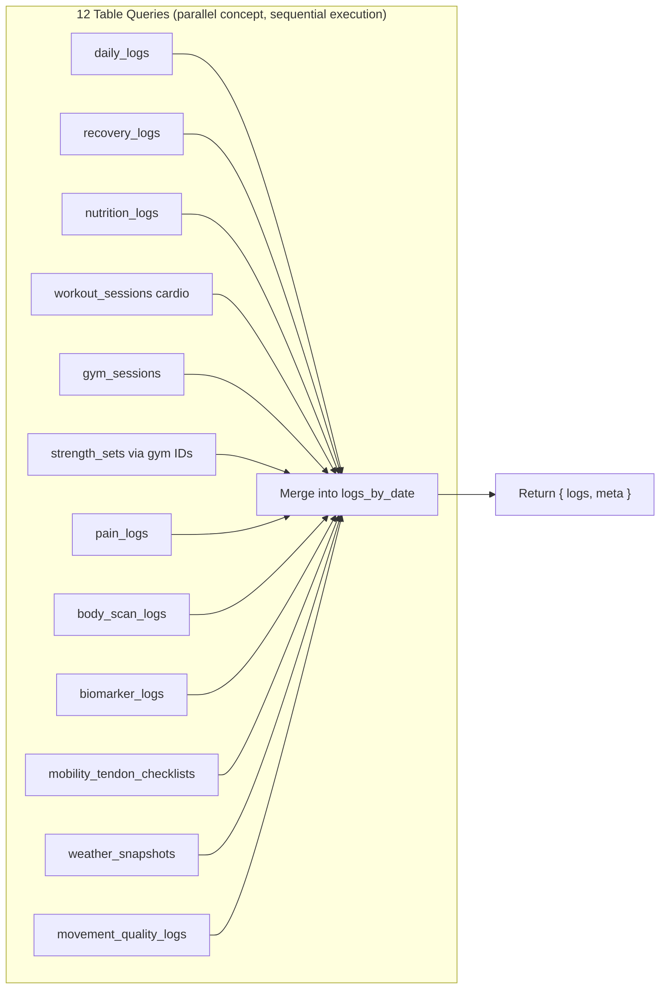

**Input**: Header `x-user-id` OR query param `userId`; query param `days` (default 120)

**Processing**: Queries 12 tables sequentially, merges all results into `{ [date]: {...} }`:
1. `daily_logs` → weight, bodyFat, CNS, workStress
2. `recovery_logs` → sleep, HRV, restingHR
3. `nutrition_logs` → macros, water, sodium
4. `workout_sessions` → cardio metrics + gym start time (reverses modality mapping)
5. `gym_sessions` → gymType, muscleTarget, prehabDone
6. `strength_sets` (via gym session IDs) → liftName, weight, sets, reps, RIR
7. `pain_logs` → injury location, pain score, side, type
8. `body_scan_logs` → InBody metrics (all scans, not just date range)
9. `biomarker_logs` → blood work results
10. `mobility_tendon_checklists` → warmup/isometric/HSR/mobility flags
11. `weather_snapshots` → temp, humidity, wind, condition (no user filter — uses first per date)
12. `movement_quality_logs` → parses issue_flags array into boolean keys

**Output**: `{ success, logs: { "2026-06-09": {...} }, meta: { totalDays, dateRange, latestBodyScan } }`

### 5c. `sync-passive` (POST/GET)

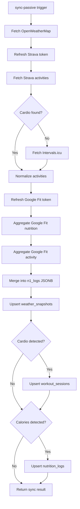

**Trigger**: pg_cron every 3 hours, or manual from Settings

**Processing**:
1. Fetch weather from OpenWeatherMap (Alexandria: 31.2°N, 29.9°E)
2. Refresh Strava token → fetch today's activities → normalize
3. If no cardio from Strava: fetch Intervals.icu activities
4. Refresh Google Fit token → aggregate nutrition + activity data
5. Merge into `n1_logs` (only overwrites non-null values)
6. Upsert `weather_snapshots` for today
7. Upsert `workout_sessions` if cardio detected
8. Upsert `nutrition_logs` if calories detected

**Output**: `{ success, date, weather, cardio, nutrition, source, syncedAt }`

### 5d. `strava-callback` (GET)

**Purpose**: OAuth2 callback — exchanges authorization code for tokens

**Processing**: Validates `code` param → POST to Strava token endpoint → upsert `strava_connections` → returns HTML success/error page

---

## 6. Database Schema

### 30 Tables in 8 Tiers

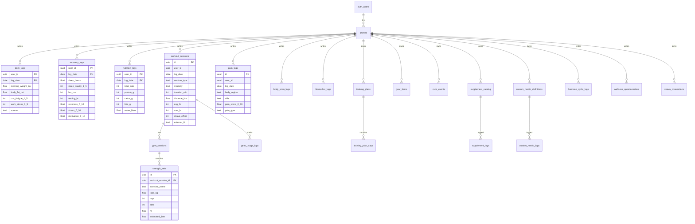

| Tier | Tables | Purpose |
|---|---|---|
| **Identity** | `profiles` | User display name, joined_at |
| **Daily Logs** | `daily_logs`, `recovery_logs`, `nutrition_logs` | Core per-date metrics |
| **Training** | `workout_sessions`, `strength_sets`, `gym_sessions` | Cardio + strength tracking |
| **Health** | `pain_logs`, `body_scan_logs`, `biomarker_logs` | Injury, InBody, blood work |
| **New Categories** | `supplement_catalog`, `supplement_logs`, `gear_items`, `gear_usage_logs`, `race_events`, `training_plans`, `training_plan_days`, `progress_photos`, `hormone_cycle_logs`, `wellness_questionnaires`, `custom_metric_definitions`, `custom_metric_logs` | Extended tracking |
| **Integrations** | `strava_connections`, `external_activity_raw`, `weather_snapshots` | External data |
| **Audit** | `data_versions` | Audit trail on all critical tables |
| **Analytics** | `mv_weekly_summaries`, `mv_gear_status`, `view_daily_dashboard`, `view_exercise_prs`, `mobility_tendon_checklists`, `movement_quality_logs`, `alerts`, `weekly_reviews`, `phase_progression_checks` | Views + functions |

### Key Functions
- `calc_readiness_score()` — PostgreSQL version of readiness calculation
- `calc_acwr()` — PostgreSQL version of ACWR
- `trigger_update_gear_mileage()` — Auto-increments gear km on workout_sessions insert

### RLS
All tables have `USING (user_id = public.auth_uid())` policies. `auth_uid()` returns JWT `auth.uid()` or falls back to guest UUID.

### Soft Deletes
All log tables have `deleted_at TIMESTAMP`. Queries filter `WHERE deleted_at IS NULL`.

---

## 7. Alert & Decision Engine

### `buildAthleteOSDecision()` — Master Orchestrator

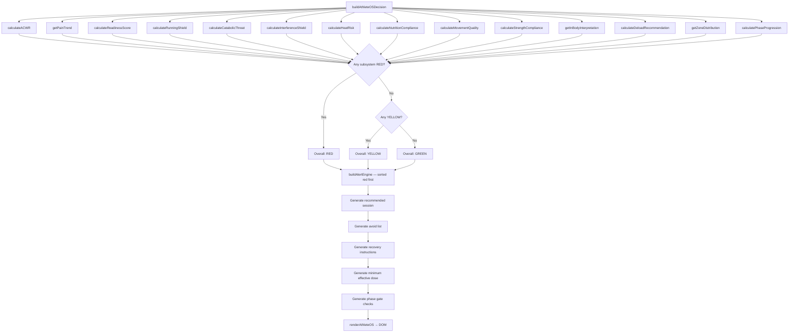

Runs 14 subsystems, determines overall status (red/yellow/green), and produces:

1. **Recommended session** — text description of what to do today
2. **Avoid list** — what NOT to do
3. **Recovery instructions** — text guidance
4. **Minimum effective dose** — lowest acceptable training
5. **Phase gate checks** — 7 criteria for Phase 2 unlock
6. **Alert ledger** — ordered list of all active alerts
7. **Reason codes** — machine-readable alert categories

### Subsystems (in priority order)

| # | Subsystem | Function | Key Logic |
|---|---|---|---|
| 1 | ACWR | `calculateACWR()` | 7-day acute / 28-day chronic load ratio |
| 2 | Pain Trend | `getPainTrend()` | 14-day rising pain detection by body region |
| 3 | Readiness | `calculateReadinessScore()` | Weighted sleep/HRV/pain/stress/soreness → 0-100 |
| 4 | Running Shield | `calculateRunningShield()` | Blocks running if weight >95kg, pain, or ACWR danger |
| 5 | Catabolic Threat | `calculateCatabolicThreat()` | Under-fueled long cardio detection |
| 6 | Interference | `calculateInterferenceShield()` | AMPK/mTOR conflict (<4h separation) |
| 7 | Heat Risk | `calculateHeatRisk()` | Temp ≥35°C or humidity ≥75% = critical |
| 8 | Nutrition | `calculateNutritionCompliance()` | Calorie/protein vs day-type targets |
| 9 | Movement Quality | `calculateMovementQuality()` | Boolean flag scan (knee cave, back round, etc.) |
| 10 | Strength Compliance | `calculateStrengthCompliance()` | 1-5 reps, ≥85% 1RM, ≥180s rest |
| 11 | InBody | `getInBodyInterpretation()` | Glycogen flush vs muscle loss detection |
| 12 | Deload | `calculateDeloadRecommendation()` | Scheduled 4th week + trigger-based |
| 13 | Zone Distribution | `getZoneDistribution()` | Zone 2/3/4-5 minute percentages |
| 14 | Phase Progression | `calculatePhaseProgression()` | 7-gate Phase 2 unlock check |

### Status Determination
- **Red** if ANY subsystem returns severity `"red"`
- **Yellow** if any returns `"yellow"` (and none red)
- **Green** otherwise

---

## 8. Calculations & Formulas

### ACWR (Acute:Chronic Workload Ratio)
```
acuteLoad  = Σ getTrainingLoad(log) for last 7 days
chronicLoad = Σ getTrainingLoad(log) for last 28 days / 4
ratio = acuteLoad / chronicLoad

Zones:
  > 1.5 → "danger" (red)
  ≥ 1.3 → "caution" (yellow)
  ≥ 0.8 → "optimal" (green)
  < 0.8 → "undertraining" (yellow)
  
Baseline: requires ≥14 days of data
```

### Training Load (per day)
```
Priority:
  1. duration_min × manualCardioRpe (if both present)
  2. stravaEffort (if present)
  3. duration_min × 5 (fallback)
```

### Readiness Score (0-100)
```
With HRV (14-day baseline required):
  score = sleep×0.25 + hrv×0.20 + painInverse×0.25 + stressInverse×0.15 + sorenessInverse×0.20

Without HRV:
  score = sleep×0.35 + painInverse×0.30 + stressInverse×0.15 + sorenessInverse×0.20

Components:
  sleepHoursScore = clamp((sleepHours / 8) × 100, 0, 100)
  sleepQualityScore = clamp(sleepQual / 5 × 100, 0, 100)
  hrvScore = clamp((hrv / hrvBaseline14day) × 100, 30, 110)
  
Deduction: -5 if previous day training load > 450

Status:
  ≥ 75 → "green"
  ≥ 50 → "yellow"
  < 50 → "red"
```

### Estimated 1RM (Epley Formula)
```
e1rm = load_kg × (1 + reps / 30)
percent1RM = current_load / e1rm
```

### Dynamic TDEE
```
weightChangeKgPerWeek = avgWeightLast7 - avgWeightPrevious7
dailyEnergyDelta = |weightChange| × 7700 / 7
estimatedTDEE = avgCalories ± dailyEnergyDelta
  (+ if gaining weight, - if losing)
Requires: ≥7 days of weight + calorie data
```

### WBGT (Wet Bulb Globe Temperature)
```
e = (humidity / 100) × 6.105 × exp(17.27 × temp / (237.7 + temp))
wbgt = 0.567 × temp + 0.393 × e + 3.94
```

### Adaptation Velocity
```
Linear regression on 7-day sliding windows of body fat %:
  slope = (n × Σxy - Σx × Σy) / (n × Σx² - (Σx)²)
  
Stall detection: avg |velocity| < 0.02%/day for ≥10 days
Triggers refeed recommendation: +400 kcal, 5-7g carbs/kg for 48h
```

### Fatigue Proxy (when CNS not directly set)
```
fatigue = clamp(5 - (hrv - 40)/30 - (sleep - 7)/2 + (5 - sleepQual)/1.5, 1, 5)
```

### Heat Risk
```
Critical: temp ≥ 35°C OR humidity ≥ 75%
High:     temp ≥ 30°C AND humidity ≥ 60%
Low:      otherwise
```

### Catabolic Carb Requirements
```
Session ≤ 70 min: no intra carbs needed
RPE ≤ 4: 45 g/hr
RPE ≤ 6: 60 g/hr  
RPE ≤ 8: 90 g/hr
RPE > 8: 100 g/hr
requiredCarbsG = durationHours × ratePerHour
```

### Interference Shield (AMPK/mTOR)
```
Separation = |cardioStartTime - gymStartTime| in hours
< 4h → red (direct molecular conflict)
4-6h → yellow (suboptimal)
≥ 6h → green (safe)
```

### Running Shield (Phase 1)
```
BLOCKS continuous running + plyometrics when:
  - Current weight > 95 kg
  - Pain score > 0 in running-related joints
  - ACWR ratio > 1.3
  - Tendon armor < 3 sessions/week
```

### Phase 2 Progression Gates (7 checks)
```
1. Weight ≤ 95 kg
2. Body fat ≤ 22%
3. Max pain ≤ 2/10
4. ACWR in safe zone (0.8-1.3)
5. Walk/jog pain-free (no pain in knees/ankles/feet)
6. Strength stable (e1RM not declining)
7. Tendon armor ≥ 3 sessions/week

Status:
  7/7 → "unlock_phase_2"
  4-6 → "partial_progression"
  < 4 → "stay_phase_1"
```

### Day Type Classification
```
cardioDuration ≥ 30 min OR stravaEffort > 0 → "endurance"
gymType != NONE → "strength"
otherwise → "rest"
```

### Nutrition Targets (Phase 1)
```
Rest day:      2000 kcal / 200g protein
Strength day:  2200 kcal / 220g protein
Endurance day: 2400 kcal / 200g protein (carb-focused)
```

### Deload Recommendation
```
Scheduled: every 4th week (weekIndex % 4 === 3)
Triggers: readiness red, ACWR danger, pain ≥ 6, ≥3 of:
  - sleep < 6.5 hrs
  - HRV suppressed > 20%
  - motivation < 4
  - soreness ≥ 7
```

### Streak Calculation
```
Consecutive days with a logged weight value, counting backwards from today
```

### Milestone Progress
```
percentage = (startWeight - currentWeight) / (startWeight - 95) × 100
Milestones: 115, 110, 105, 100, 95 kg
```

### Gut Training Baseline
```
From last 10 sessions with duration ≥ 60 min and intra-carbs logged:
  avgPerHour = mean(carbsPerHour)
  maxPerHour = max(carbsPerHour)
Cross-referenced in fueling simulation for safety warnings
```

### Fueling Simulation
```
Input: duration, RPE, weight, temperature
Carb rate by RPE:
  ≤ 4 → 45 g/hr
  ≤ 6 → 60 g/hr
  ≤ 8 → 90 g/hr
  > 8 → 100 g/hr
Heat adjustment: +15 g/hr if temp > 28°C
Total carbs = durationHours × adjusted rate
Sodium: 500-700 mg/hr
Fluid: 500-800 ml/hr
Pre-race carb load: 8-10 g/kg × weight
```

---

## 9. New Data Category Workflows

### Supplements
```
Catalog: localStorage('n1_supp_catalog') ←→ Supabase supplement_catalog
Default: 8 items (Creatine 5g, Vitamin D3, Omega-3, Magnesium, Zinc, Ashwagandha, Melatonin, Electrolytes)
Flow: Render chips → tap to toggle active → collectSupplements() on save → stored in log.supplements[]
Cloud: saveSuppCatalog() upserts to supplement_catalog; loadCloudSettings() pulls on startup
```

### Gear Tracker
```
Store: localStorage('n1_gear') ←→ Supabase gear_items
Flow: Add (name, type, lifeKm) → progress bar (currentKm/lifeKm × 100%)
  - >90% → danger (red)
  - >75% → warn (yellow)
  - ≤75% → ok (green)
Retire: marks retired=true, removes from active list
Cloud: saveGearStore() upserts; loadCloudSettings() pulls
```

### Race Events
```
Store: localStorage('n1_races') ←→ Supabase race_events
Flow: Add (name, date, distance, type, priority) → countdown display
  - ≤7 days → red
  - ≤30 days → yellow
  - >30 days → green
Cloud: saveRaceStore() upserts; loadCloudSettings() pulls
```

### Custom Metrics
```
Definitions: localStorage('n1_custom_metrics') ←→ Supabase custom_metric_definitions
Values: stored inside state.logs[date].customMetrics = { name: value }
Types: number, scale (1-10 range), boolean, text
Flow: Define metric → render input → collectCustomMetrics() → saved with log
```

### Wellness Check-In
```
Stored in: state.logs[date].wellness = { mood, digestion, joints, confidence, sorenessLocs, timestamp }
4 range sliders (1-5) + free-text soreness locations
Save button calls saveWellnessCheckIn() → saveData()
Preserved when "Save Mission Log" is clicked (merged from existing state)
```

### Hormone Cycle
```
Stored in: state.logs[date].hormone = { cycleDay, phase, basalTempC, energyLevel, cramps, bloating, notes }
Save button calls saveHormoneEntry() → saveData()
Preserved when "Save Mission Log" is clicked
```

### Progress Photos
```
Storage: Supabase Storage bucket 'progress-photos' (public read, user-scoped write)
Fallback: localStorage base64 data URLs (limited to ~5MB total)
Flow: File input → if Supabase: upload to {userId}/{date}_{id}.{ext}, get public URL
                     → else: FileReader.readAsDataURL → store in localStorage
Cloud pull: loadPhotosFromCloud() lists bucket files, fetches public URLs
Render: last 20 photos as thumbnails
```

### Training Plans
```
Store: localStorage('n1_training_plans') ←→ Supabase training_plans
Default template: Mon=Heavy Day A, Tue=Zone 2, Wed=Heavy Day B, Thu=Rest, Fri=Tendon, Sat=Zone 2, Sun=Rest
Flow: Create (name, start/end, phase) → render 7-day grid → deactivate when done
Cloud: saveTrainingPlanStore() upserts active plans; loadCloudSettings() pulls
```

---

## 10. External Integrations

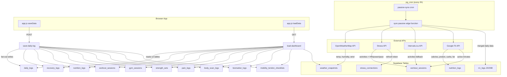

### OpenWeatherMap
```
Endpoint: api.openweathermap.org/data/2.5/weather
Location: Alexandria, Egypt (31.2001°N, 29.9187°E)
Data: temp_c, humidity_pct, wind_speed_mps, condition
Called by: sync-passive (every 3h), app.js fetchWeather() (on startup if key set)
Heat risk: calculated from temp + humidity
```

### Strava
```
Auth: OAuth2 authorization code → refresh token
Flow: connectStrava() → browser redirect → strava-callback edge function → token exchange → store in strava_connections
Sync: sync-passive refreshes token → fetches today's activities → normalizes → stores
Data: type, duration, distance, HR, power, pace, calories, elevation, effort score
```

### Intervals.icu
```
Auth: Basic auth (athlete_id + API key)
Fallback: only fetched if Strava returned no cardio for today
Data: same fields as Strava, normalized identically
```

### Google Fit
```
Auth: OAuth2 refresh token
Data sources:
  - com.google.nutrition → calories, protein, carbs, fat
  - com.google.activity.segment → active minutes (excludes still/vehicle/running)
Always runs regardless of Strava result
```

### pg_cron Auto-Sync
```
Job: passive-sync-cron
Schedule: 0 */3 * * * (every 3 hours)
Method: pg_net.http_post to sync-passive edge function
Auth: hardcoded anon key + apikey header + guest user-id
```

---

## 11. Charts

13 charts rendered via Chart.js with `requestAnimationFrame` progressive rendering:

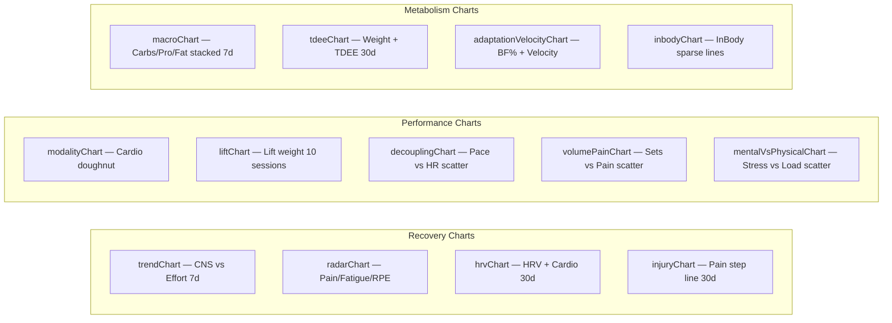

| # | ID | Type | X-axis | Y-axis(s) | Data Source |
|---|---|---|---|---|---|
| 1 | trendChart | Line | 7 days | CNS Fatigue + Strava Effort (dual) | `cnsFatigue`, `stravaEffort` |
| 2 | radarChart | Radar | 3 axes | Pain / Fatigue / RPE | `injuryPain`, `cnsFatigue`, `manualCardioRpe` |
| 3 | hrvChart | Line + Bar | 30 days | HRV (line) + Cardio Volume (bar) | `hrv`, `manualCardioDuration` |
| 4 | injuryChart | Step Line | 30 days | Pain Level | `injuryPain` |
| 5 | macroChart | Stacked Bar | 7 days | Carbs / Protein / Fats | `carbsG`, `proG`, `fatsG` |
| 6 | modalityChart | Doughnut | — | Distribution | `cardioType` counts (WALK_JOG, CYCLING, ROWING, SWIMMING, RUNNING) |
| 7 | liftChart | Line | Last 10 entries | Lift Weight | `liftWeight` |
| 8 | decouplingChart | Scatter | Pace | HR | `stravaPace` vs `avgHR` |
| 9 | tdeeChart | Line + Line | 30 days | Weight + TDEE (dual) | `weight`, calculated TDEE |
| 10 | volumePainChart | Scatter | Muscle Sets | Joint Pain | `muscleSets` vs `injuryPain` |
| 11 | mentalVsPhysicalChart | Scatter | Work Stress | Training Load | `workStress` vs training load |
| 12 | adaptationVelocityChart | Line + Line | All data | Body Fat % + Velocity slope | `bodyFatPct`, linear regression |
| 13 | inbodyChart | Line | All scans | Weight / BF% / SMM | `inbodyWeight`, `inbodyBf`, `inbodySmm` |

### Cockpit Sparklines (4)
| ID | Metric | Days |
|---|---|---|
| spark-acwr | ACWR training load | 7 |
| spark-wbgt | WBGT temperature | 7 |
| spark-tdee | Dynamic TDEE | 7 |
| spark-fatigue | Fatigue proxy | 7 |

### Joint Heatmap
```
Aggregates max pain per body location over 14 days
Maps location → joint point element ID via injuryLocMap
Colors: ≥8 red (#ff0000, 0.9 opacity), ≥5 orange (#ff6600, 0.7), ≥1 yellow (#ffcc00, 0.5)
```

---

## 12. Navigation & UI

```mermaid
flowchart TD
    NAV[Bottom Nav Bar] --> DASH[Dashboard Tab]
    NAV --> LOG[Log Tab]
    NAV --> PROG[Progress Tab]
    NAV --> SET[Settings Tab]
    NAV --> LIB[Library Tab]

    DASH --> HUB[Hub Dashboard]
    HUB --> COCKPIT[Cockpit: ACWR, WBGT, TDEE, Fatigue]
    HUB --> ATHOS[Athlete OS Decision Panel]
    HUB --> MILESTONE[Weight Milestones: 95kg Goal]
    HUB --> STRAVA_INBOX[Strava Activity Inbox]

    LOG --> SUBJECTIVE[Subjective: Weight, CNS, Stress, BodyFat]
    LOG --> RECOVERY[Recovery: Sleep, HRV, Soreness]
    LOG --> WELLNESS[Wellness: Mood, Digestion, Joints, Confidence]
    LOG --> INJURY[Injury: Joint, Pain, Side, Type, Timing]
    LOG --> STRENGTH[Strength: Gym Type, Lift, Sets, Reps, RIR]
    LOG --> CARDIO[Cardio: Type, Duration, RPE, Zones 1-5]
    LOG --> SUPPLEMENTS[Supplements: Tap-to-toggle checklist]
    LOG --> NUTRITION[Nutrition: Calories, Macros, Water, Sodium]
    LOG --> BIOMARKER[Biomarker Vault: Testosterone, Cortisol, CRP, Ferritin]
    LOG --> INBODY[InBody: Weight, SMM, BF%, TBW]

    PROG --> SUB_NAV{Sub-nav Pills}
    SUB_NAV --> REC Charts[Recovery: Trend, Radar, HRV, Injury]
    SUB_NAV --> PERF Charts[Performance: Modality, Lift, Decoupling]
    SUB_NAV --> MET Charts[Metabolism: Macros, TDEE, Velocity, InBody]
    PROG --> HEATMAP[Joint Armor Heatmap]
    PROG --> HISTORY[Historical Logs + JSON Dump]

    SET --> MACRO[Macrocycle Selector]
    SET --> GEAR[Gear Tracker: Shoes/Bike + KM bars]
    SET --> RACES[Race Events: Countdown + Priority]
    SET --> CUSTOM[Custom Metrics: Define + Log]
    SET --> HORMONE[Hormone Cycle: Phase, Temp, Energy]
    SET --> PHOTOS[Progress Photos: Upload/Timeline]
    SET --> PLANS[Training Plans: Weekly Builder]
    SET --> DATA_MGMT[Data: Export CSV, Backup, Reset, Logout]
```

### Tabs
| Tab | View ID | On Activate |
|---|---|---|
| Dashboard | view-dashboard | renderAllCharts(), updateJointHeatmap() |
| Log | view-log | updateLogForm(), restoreSupplementForm(), restoreWellnessForm(), restoreHormoneForm(), renderCustomMetrics() |
| Progress | view-progress | renderAllCharts(), updateJointHeatmap() |
| Settings | view-settings | updateSettingsView(), renderGearList(), renderRaceList(), renderCustomMetrics(), renderPhotoTimeline(), renderTrainingPlans() |
| Library | view-library | (filter only) |

### Sub-Navigation (Progress tab)
3 pill groups: Recovery, Performance, Metabolism — toggles `.chart-group` visibility

### Form Pills
Custom pill-based selectors that replace `<select>` elements for macrocycle (HYPERTROPHY/STRENGTH/ENDURANCE/DELOAD) — syncs hidden input value on click.

### Toasts
Non-blocking notifications via `showToast(msg)` — auto-dismiss after 3 seconds.

---

## Appendix: File Structure

```
fitness-pwa/
├── index.html              PWA HTML (~2160 lines)
├── app.js                  PWA logic (~4444 lines)
├── styles.css              All styles (~1133 lines)
├── sw.js                   Service worker v26
├── manifest.json           PWA manifest
├── icon-192.png, icon-512.png, icon.svg
├── supabase/
│   ├── migrations/
│   │   ├── 001_comprehensive_schema.sql   30 tables, indexes, triggers, RLS, views
│   │   ├── 002_migrate_jsonb.sql          Data migration from JSONB to normalized
│   │   └── pg_cron_sync.sql               Cron job (every 3h)
│   └── functions/
│       ├── save-daily-log/index.ts        Write to 9 tables
│       ├── load-dashboard/index.ts        Read from 12 tables
│       ├── sync-passive/index.ts          External API sync
│       ├── strava-callback/index.ts       OAuth callback
│       └── _shared/cors.ts                Shared utilities
├── .github/workflows/
│   ├── deploy.yml           SCP to VPS on push to main
│   └── nightly_sync.yml     Cron trigger for sync-passive
├── docs/
│   └── BACKLOG.md           Prioritized feature backlog
└── .env                     API keys (gitignored)
```
